# drawn-by-code

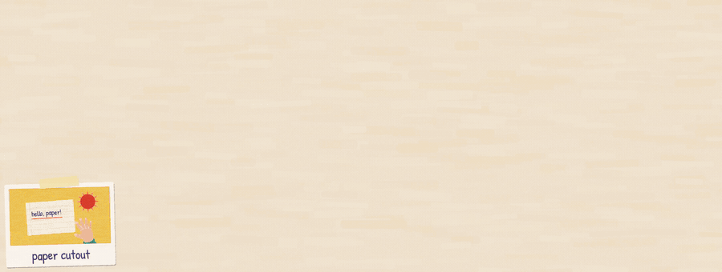

<sub>This cover is itself drawn by the repo: the paper kit tears the tiles and the hand, and each polaroid is painted live by its own style's kit ([readme-cover](sandbox/2026-09-24-readme-cover/)).</sub>

Animations and videos made **with code** by Claude. JavaScript paints every frame on a
`<canvas>` (2D, or 3D through WebGL2), deterministically. Chromium and ffmpeg render the
frames to MP4. No After Effects, no AI-generated video: every torn edge, fingerprint and
hand is code.

**The goal: push Claude's knowledge and visual limits as far as they go.** How far can a
language model get as an animator, with nothing but code: paper that tears like paper,
hands that hold a mug the right way round, clay that looks like clay, a replica you have
to zoom into to tell apart? Every experiment here pushes that edge a little further.

The repo is both a **toolbox** (engine, styles, Claude skills) and a **test bench**. Every
experiment in `sandbox/` goes through an automatic review (real frames, determinism,
rhythm, motion) and through human feedback. What is learned goes back into the skills, so
every test improves the next one.

## A hub for styles: contribute

The idea is for this to become a **hub**: a growing library of animation styles, each with
its drawing kit, its template, its skill (the rules and the checklist that keep it
consistent) and the videos that prove it. Styles and skills are yours to add and improve,
by pull request:

- **A new style:** risograph, pixel art, isometric, whiteboard, stained glass, woodcut,
  anime, a style no one has named yet.
- **A better existing style:** more detail, a fixed pitfall, a new pose for the hands, a
  faster kit, a lesson learned the hard way.
- **The engine and the skills:** tools, review checks, sound, transitions, the process.

Every contribution follows the same loop as everything else here: a render, frames looked
at, a review. See [CONTRIBUTING.md](CONTRIBUTING.md).

## Why it is all public

A lot of impressive AI-made videos get posted with no prompt, no skill and no word on how
they were made. We respect that choice, but we think everyone would learn faster, and the
field would grow faster, if that knowledge were public.

So nothing here is hidden:
- **Code:** the engine and every scene.
- **Skills:** the ones that direct Claude, including their rules, checklists and pitfalls.
- **The process:** every experiment's brief, its rounds of review with the feedback quoted
  verbatim, and the lessons that came out of them.

If a video here makes you want to try something, everything you need to make it, or to do
it better, is in this repo. And if you publish a video made with AI, consider publishing
how you made it too.

## Gallery

<table>
<tr>
<td width="50%" valign="top">
<a href="sandbox/2026-09-24-saas-promo/">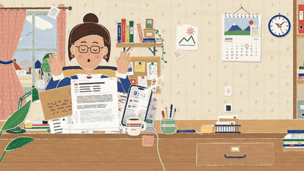</a><br>
<b><a href="sandbox/2026-09-24-saas-promo/">saas-promo</a></b> · paper cutout · 50 s · <a href="sandbox/2026-09-24-saas-promo/render/saas-promo.mp4">mp4</a><br>
<sub>A marketing video for an invoicing product: a desk buried in paperwork is cleared block by block. Built by parallel agents on one brief, with music and sound effects.</sub>
</td>
<td width="50%" valign="top">
<a href="sandbox/2026-09-24-what-do-you-love/">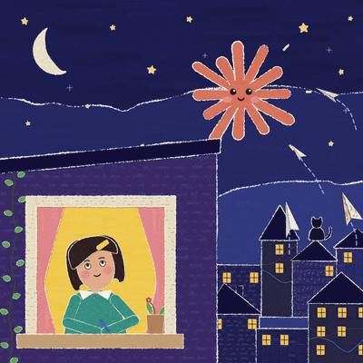</a><br>
<b><a href="sandbox/2026-09-24-what-do-you-love/">what-do-you-love</a></b> · paper cutout · 28 s · <a href="sandbox/2026-09-24-what-do-you-love/render/what-do-you-love.mp4">mp4</a><br>
<sub>A 1:1 replica, made as a study, of <a href="https://x.com/kevin_t_ngo/status/2102437977435893771">a paper-cutout video by Kevin Ngo</a> (<a href="https://x.com/kevin_t_ngo">@kevin_t_ngo</a>). The original design and animation are his. Measured drawing by drawing until the differences only show when zooming in (skill <code>replicate</code>). His video also inspired the first saas-promo.</sub>
</td>
</tr>
<tr>
<td width="50%" valign="top">
<a href="sandbox/2026-09-24-exquisite-corpse/">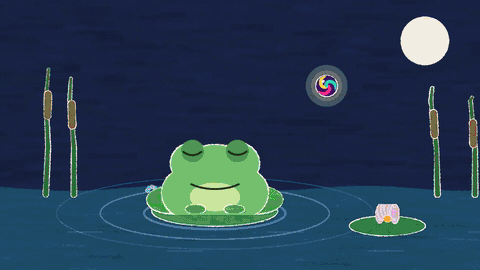</a><br>
<b><a href="sandbox/2026-09-24-exquisite-corpse/">exquisite-corpse</a></b> · five styles · 30 s · <a href="sandbox/2026-09-24-exquisite-corpse/render/exquisite-corpse.mp4">mp4</a><br>
<sub>One object travels through five styles joined by transitions: paper, a 70s poster, liquid light, a kaleidoscope and line.</sub>
</td>
<td width="50%" valign="top">
<a href="sandbox/2026-09-24-clay3d-test/">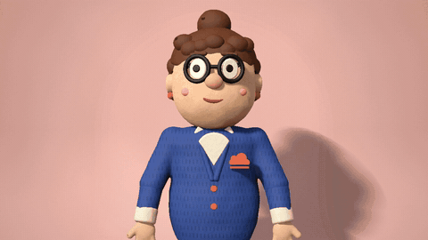</a><br>
<b><a href="sandbox/2026-09-24-clay3d-test/">clay3d-test</a></b> · clay 3D · 4 s · <a href="sandbox/2026-09-24-clay3d-test/render/clay3d-test.mp4">mp4</a><br>
<sub>A plasticine puppet raymarched in the browser: lumpy pressed-on pieces, matte clay and a studio sweep.</sub>
</td>
</tr>
<tr>
<td width="50%" valign="top">
<a href="sandbox/2026-09-24-fube-clay/">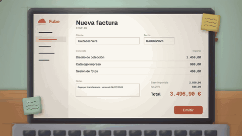</a><br>
<b><a href="sandbox/2026-09-24-fube-clay/">fube-clay</a></b> · clay 2D · 6 s · <a href="sandbox/2026-09-24-fube-clay/render/fube-clay.mp4">mp4</a><br>
<sub>The saas-promo invoice block redone in 2D clay, as a style comparison.</sub>
</td>
<td width="50%" valign="top">
<a href="sandbox/2026-09-24-coffee-first/">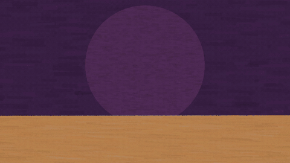</a><br>
<b><a href="sandbox/2026-09-24-coffee-first/">coffee-first</a></b> · paper cutout · 6 s · <a href="sandbox/2026-09-24-coffee-first/render/coffee-first.mp4">mp4</a><br>
<sub>The first style test: a sleepy mug wakes up.</sub>
</td>
</tr>
</table>

Every experiment, with its status and main lesson, is in [`sandbox/INDEX.md`](sandbox/INDEX.md).

## Styles

Each style is a drawing kit, a template and a skill with its rules. Open a style's folder
to see its strip, files and the videos made with it.

| Style | Look | Status |
|---|---|---|
| [paper-cutout](styles/paper-cutout/) | torn paper, marker, grain, handwriting, real hands | approved |
| [70s-poster](styles/70s-poster/) | flat acid colours, echoes, sunbursts, melting letters | approved |
| [liquid-light](styles/liquid-light/) | merging oil blobs, a 60s light show | approved |
| [kaleidoscope](styles/kaleidoscope/) | mirror symmetry, rotation, colour cycling | approved |
| [line](styles/line/) | a wobbling black line on white paper | approved |
| [clay](styles/clay/) | 2D plasticine: bevels, fingerprints, soft shadows | in testing |
| [clay3d](styles/clay3d/) | 3D plasticine puppets, raymarched, studio light | in testing |
| [risograph](styles/risograph/) | four spot inks, halftone, overprints, misregistration | in testing |
| [pixel-art](styles/pixel-art/) | crisp pixels on a low-res grid, sprite maps, 10 fps loops | in testing |

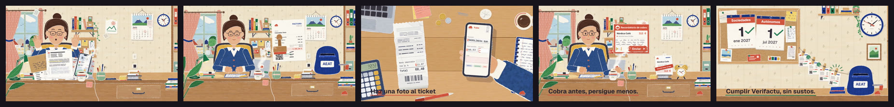
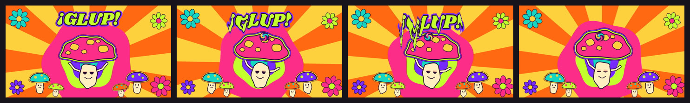
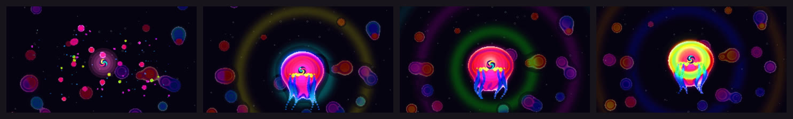
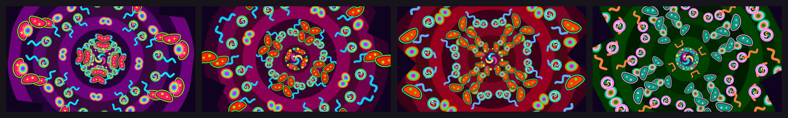
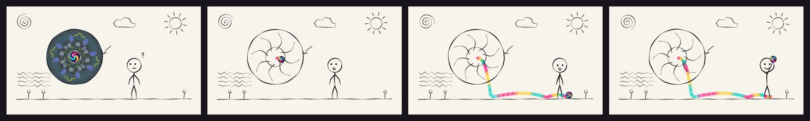
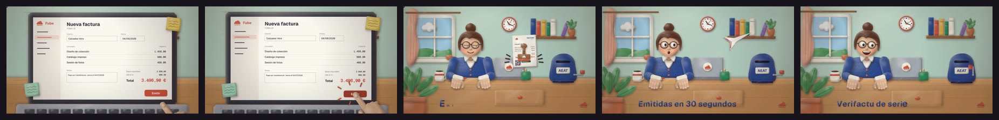
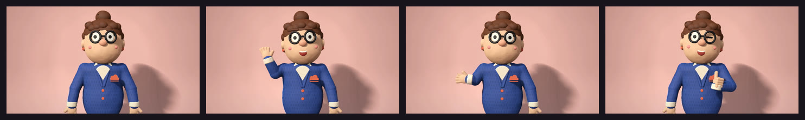
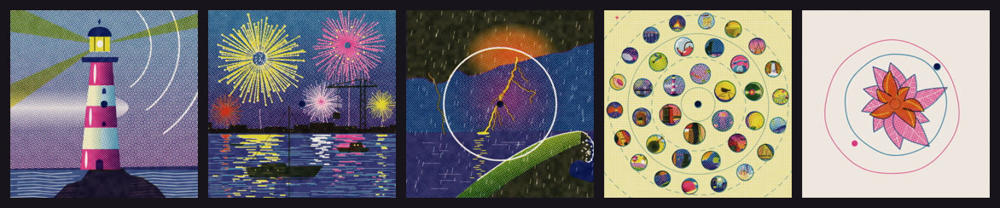
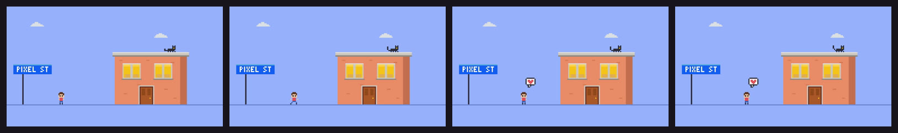

To add one: the `new-style` skill, and [CONTRIBUTING.md](CONTRIBUTING.md) for the pull request.

## Getting started

Requirements: Node 20 or later, Chrome or Chromium, and ffmpeg (`sh engine/setup.sh`
installs what is missing).

```bash
npm install
node engine/new.mjs my-test --style paper-cutout --duration 5
npm run preview                                      # http://127.0.0.1:5173
node engine/review.mjs sandbox/<exp>/scene.js        # automatic review + contact sheet
node engine/render.mjs sandbox/<exp>/scene.js --size 1920   # the MP4
```

With Claude Code, just ask: *"make me a 10 s paper-cutout video for…"*. The `animate`
skill guides the process: brief → script → style test → animatic → final.

## How it works

- **A scene is a pure function of time.** `Motion.scene({ draw(g, t, env) })` paints frame
  `t` with no state carried between frames, so any frame can be rendered alone and the
  review can check determinism. Stop-motion styles change drawing every 1/12 s ("on twos").
- **The engine** (`engine/`): `player.html` runs the scene in headless Chromium,
  `render.mjs` pipes the frames to ffmpeg, and `review.mjs` critiques a render (still
  stretches, jumps, holes, speed, determinism) and makes a contact sheet. There are also:
  - `reference.mjs`: measures a reference video (colours, positions, cuts, tracking,
    side-by-side comparisons);
  - `tempo.mjs`: reads BPM and loudness;
  - `mix.mjs`: music plus effects, each aligned on the frame where you hear it;
  - `transitions.js`: transitions between styles;
  - `strip.mjs` and `gif.mjs`: the strips and GIFs on this page.
- **Skills** (`.claude/skills/`) hold the process and the taste:
  - `animate` (brief to MP4) and `review` (the critique loop);
  - `engine` and `sound`;
  - `replicate` (copying a reference 1:1) and `transitions`;
  - one skill per style.

## How it learns

```
brief ─▶ scene.js ─▶ review.mjs ─▶ Claude's critique ─▶ fix  (≤3 rounds)
                                                     │
                                       user feedback ◀┘
                                                     │
      does it generalize? ─▶ style skill / animate / engine / sound / review.mjs
                                                     │
                                             commit per round
```

The user's words are kept verbatim in each experiment's `review.md`. A lesson that
generalizes becomes a rule in a skill: hands drawn by side and view, logos traced from the
brand's SVG, bounding volumes that must not cast shadows.

## Repository

| Path | What it is |
|---|---|
| `engine/` | the engine and its tools |
| `styles/<style>/` | a style's kit, template, strip and README |
| `.claude/skills/` | Claude's skills: process, engine, sound, one per style |
| `sandbox/<date>-<name>/` | one experiment per folder: brief, scene, reviews, contact sheet, latest render |
| `assets/sfx/`, `fonts/` | sound effects and freely licensed fonts |
| `CONTRIBUTING.md` | how to add or improve a style by pull request |

## Licenses

Patrick Hand, Shrikhand and Short Stack fonts under the SIL OFL 1.1 (`fonts/`). The effects in
`assets/sfx/` were generated with ElevenLabs: commercial use requires a paid plan.
A client's source files (brand copy, logo files, fonts, music) live in the experiment's
`private/` folder and are not committed.
