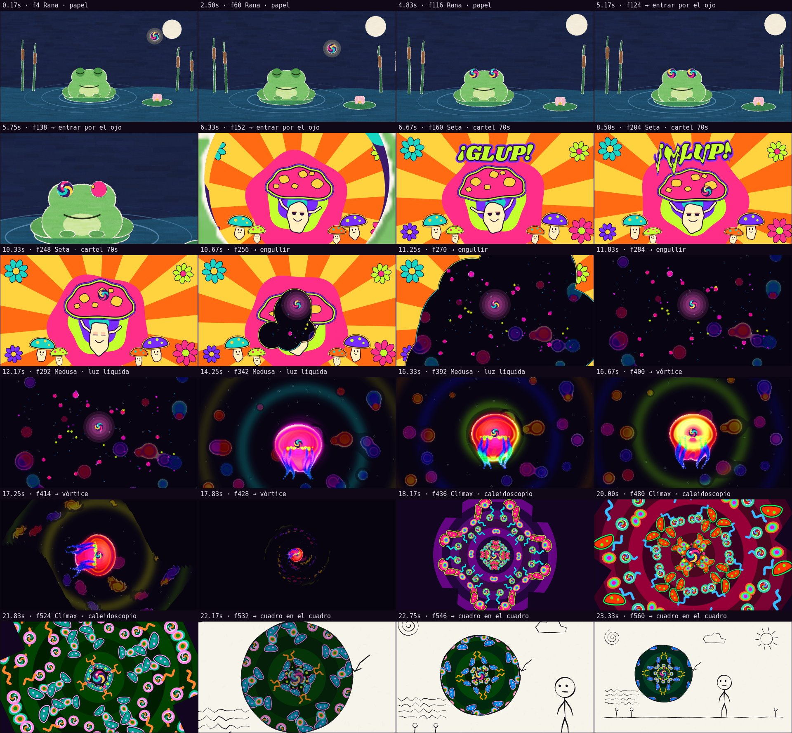
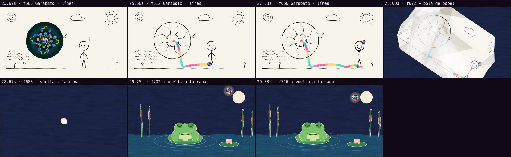

# Revisión automática · sandbox/2026-09-24-cadaver-exquisito/scene.js

960×540 px · 24 fps · 30.00 s · 720 fotogramas · 120 BPM

## Avisos

- **Fotogramas planos** (un solo color) en 18.00 s.

## Movimiento

Energía por segundo (cuánto cambia la imagen):

```
▂▂▂▂▂▄▆▅▅▅▆▄▃▄▄▄▄▃▇▆▇█▅▃▃▂▂▅▅▃
0    5    10   15   20   25   
```

Sin tramos quietos de 1 s o más.

Saltos grandes fuera de los cortes (en patrones densos pueden ser normales; mira si molestan): 11.17 s, 18.50 s, 19.00 s, 20.00 s, 20.50 s, 20.67 s, 20.83 s, 21.00 s, 21.17 s, 21.50 s, 28.00 s.

## Velocidad

Pintado: 45 ms/fotograma en frío, 11 ms en caliente → render completo ≈ 8 s a este tamaño.

## Hoja de contacto



