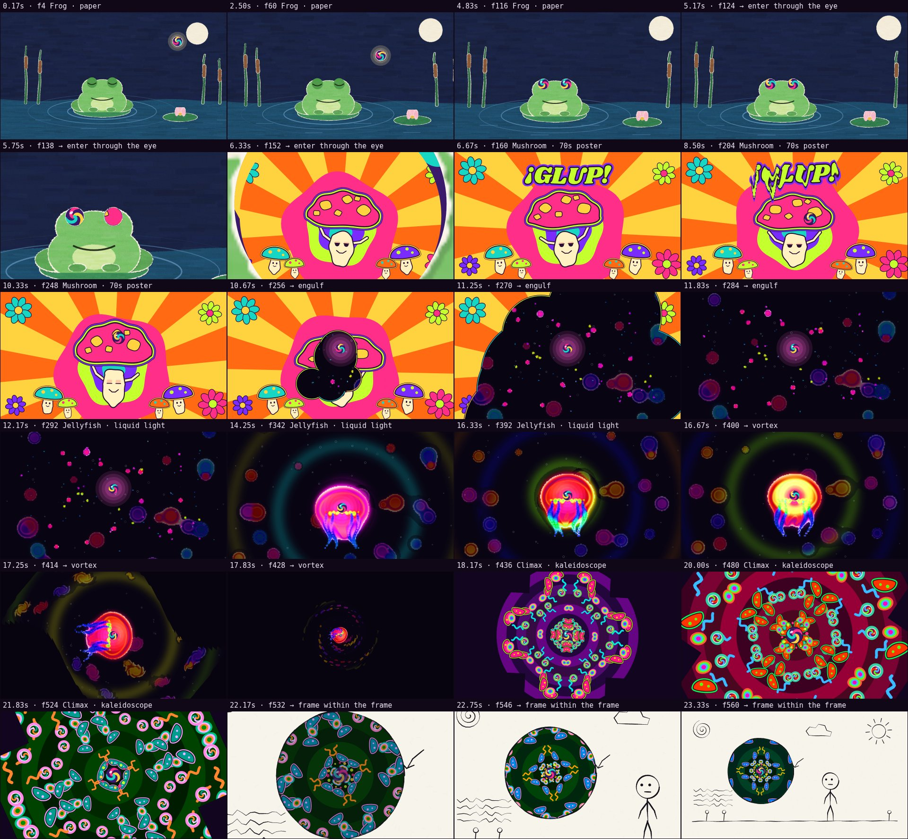
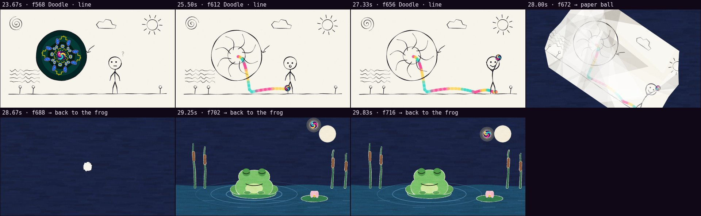

# Automatic review · sandbox/2026-09-24-exquisite-corpse/scene.js

960×540 px · 24 fps · 30.00 s · 720 frames · 120 BPM

## Warnings

- **Flat frames** (a single color) at 18.00 s.

## Motion

Energy per second (how much the image changes):

```
▂▂▂▂▂▄▆▅▅▅▆▄▃▄▄▄▄▃▇▆▇█▅▃▃▂▂▅▅▃
0    5    10   15   20   25   
```

No still stretches of 1 s or more.

Large jumps outside cuts (can be normal in dense patterns; check whether they bother): 11.17 s, 18.50 s, 19.00 s, 20.00 s, 20.50 s, 20.67 s, 20.83 s, 21.00 s, 21.17 s, 21.50 s, 28.00 s.

## Speed

Painting: 61 ms/frame cold, 15 ms warm → full render ≈ 11 s at this size.

## Contact sheet



