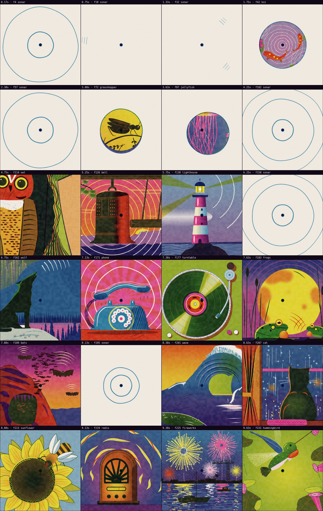
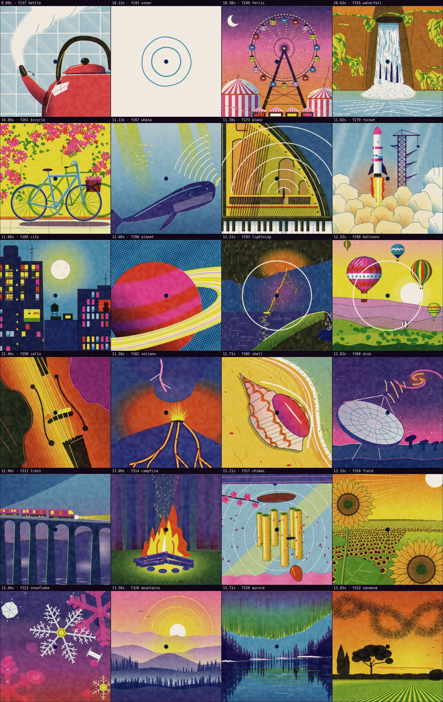
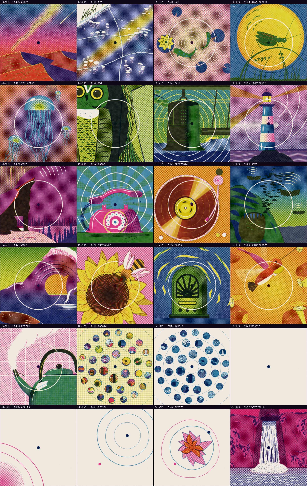
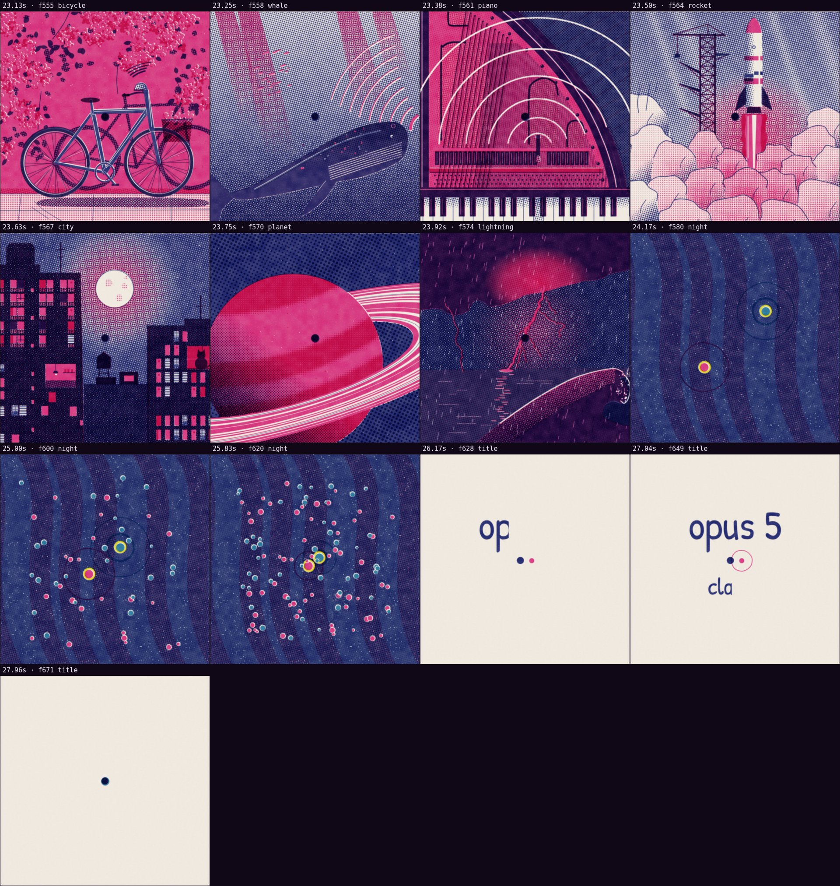

# Automatic review · sandbox/2026-09-24-opus5-riso/scene.js

960×960 px · 24 fps · 28.00 s · 672 frames

## Warnings

- **Flashes** more than 3 per second (photosensitivity risk): 12–13 s (5), 13–14 s (5), 15–16 s (5), 23–24 s (4). Soften the brightness changes or lower the contrast.

## Motion

Energy per second (how much the image changes):

```
▁▃▂▃▅▅▅▇▇▆▆▇█▇▇▇▂▃▂▂▂▂▅▇▁▅▁ 
0    5    10   15   20   25   
```

No still stretches of 1 s or more.

## Speed

Painting: 154 ms/frame cold, 161 ms warm → full render ≈ 108 s at this size.

## Contact sheet





