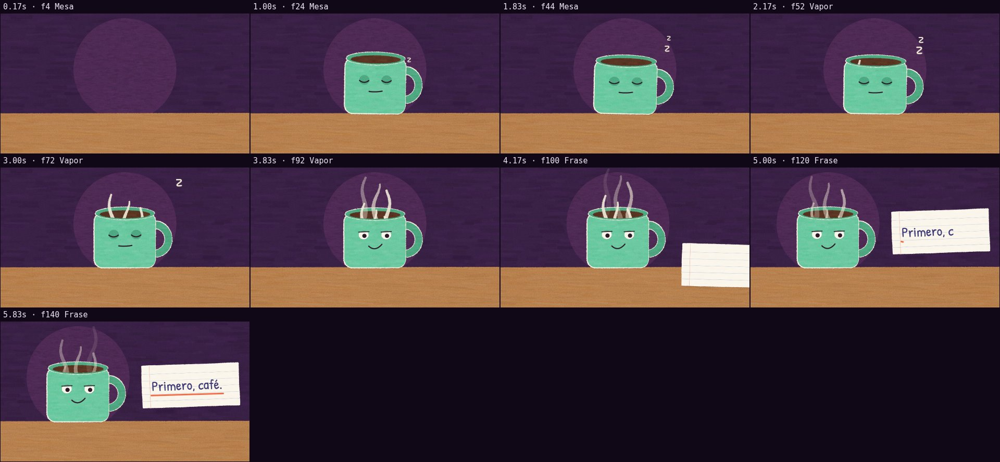

# Revisión automática · sandbox/2026-09-24-primero-cafe/scene.js

960×540 px · 24 fps · 6.00 s · 144 fotogramas · 120 BPM

## Avisos

- Ninguno.

## Movimiento

Energía por segundo (cuánto cambia la imagen):

```
▄▂▂▂█▂
0    5    
```

Sin tramos quietos de 1 s o más.

Saltos bruscos (cortes o fogonazos; comprobar que son cortes de plano): 4.33 s.

## Velocidad

Pintado: 60 ms/fotograma en frío, 10 ms en caliente → render completo ≈ 1 s a este tamaño.

## Hoja de contacto


