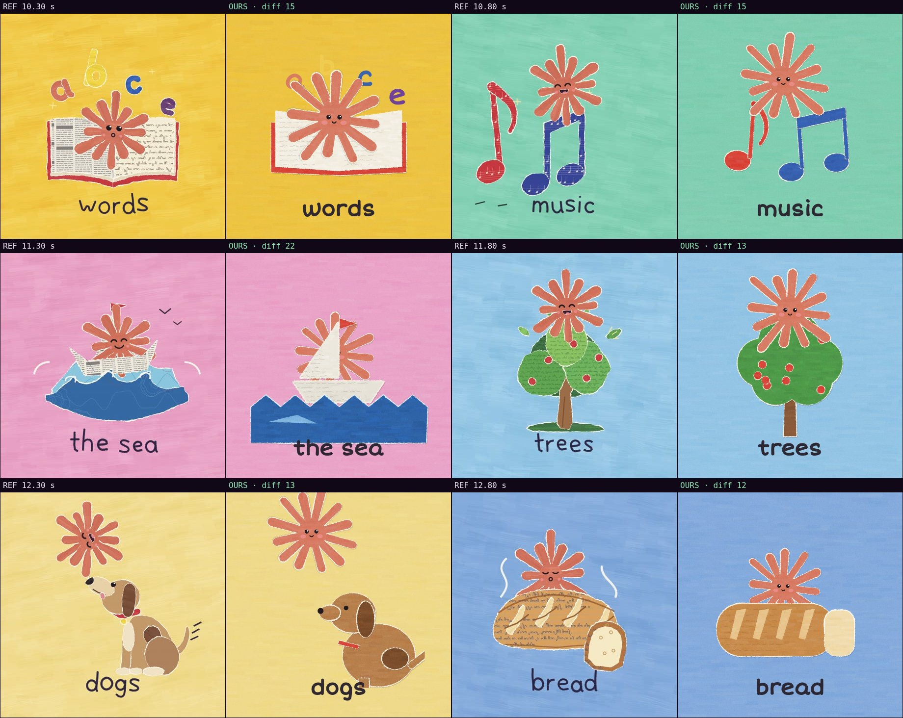

# Comparison with the reference · sandbox/2026-09-24-what-do-you-love/scene.js

Reference: `reference.mp4` · mean difference **15.0** (0 = identical, <30 similar, >60 something else)

| Second | Difference |
|---|---|
| 10.30 | 14.9 |
| 10.80 | 15.2 |
| 11.30 | 22.3 |
| 11.80 | 12.8 |
| 12.30 | 12.9 |
| 12.80 | 11.7 |

