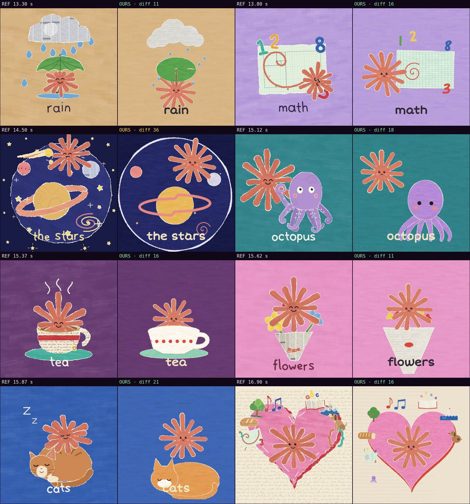

# Comparison with the reference · sandbox/2026-09-24-what-do-you-love/scene.js

Reference: `reference.mp4` · mean difference **17.9** (0 = identical, <30 similar, >60 something else)

| Second | Difference |
|---|---|
| 13.30 | 10.6 |
| 13.80 | 16.1 |
| 14.50 | 35.6 |
| 15.12 | 17.5 |
| 15.37 | 16.2 |
| 15.62 | 10.5 |
| 15.87 | 21.3 |
| 16.90 | 15.7 |

