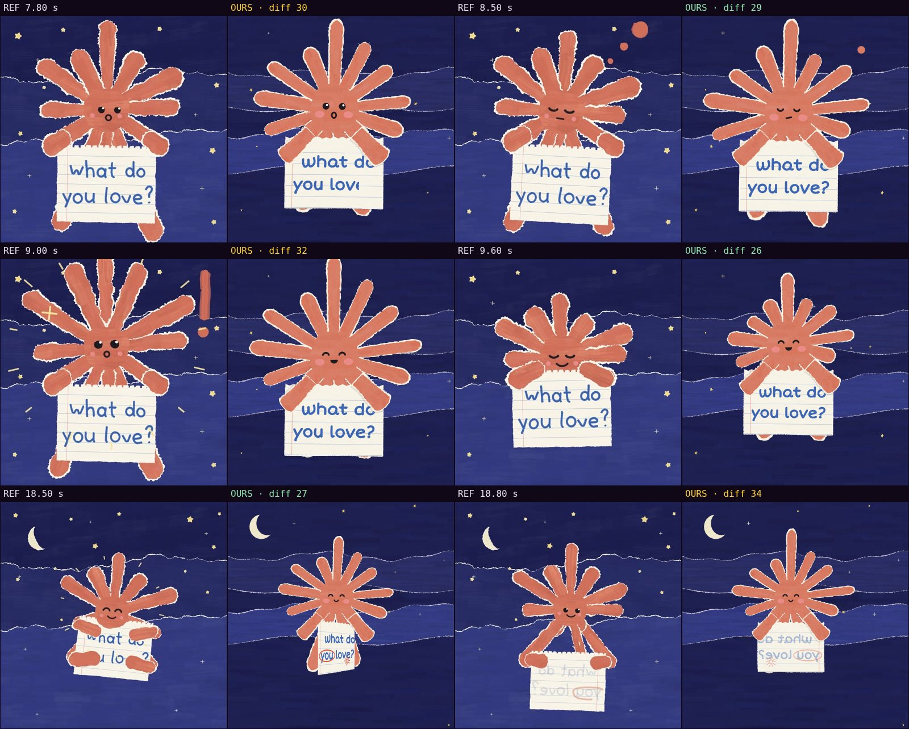

# Comparison with the reference · sandbox/2026-09-24-what-do-you-love/scene.js

Reference: `reference.mp4` · mean difference **29.9** (0 = identical, <30 similar, >60 something else)

| Second | Difference |
|---|---|
| 7.80 | 30.2 |
| 8.50 | 29.5 |
| 9.00 | 31.7 |
| 9.60 | 25.9 |
| 18.50 | 27.4 |
| 18.80 | 34.4 |

