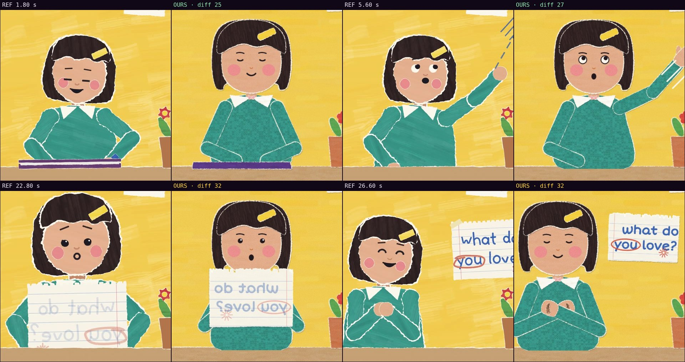

# Comparison with the reference · sandbox/2026-09-24-what-do-you-love/scene.js

Reference: `reference.mp4` · mean difference **29.0** (0 = identical, <30 similar, >60 something else)

| Second | Difference |
|---|---|
| 1.80 | 25.5 |
| 5.60 | 26.5 |
| 22.80 | 32.3 |
| 26.60 | 31.8 |

