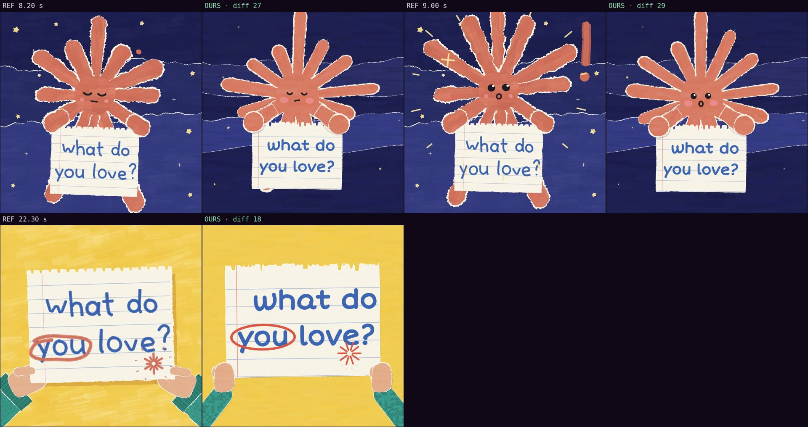

# Comparison with the reference · sandbox/2026-09-24-what-do-you-love/scene.js

Reference: `reference.mp4` · mean difference **24.7** (0 = identical, <30 similar, >60 something else)

| Second | Difference |
|---|---|
| 8.20 | 27.2 |
| 9.00 | 28.8 |
| 22.30 | 18.2 |

