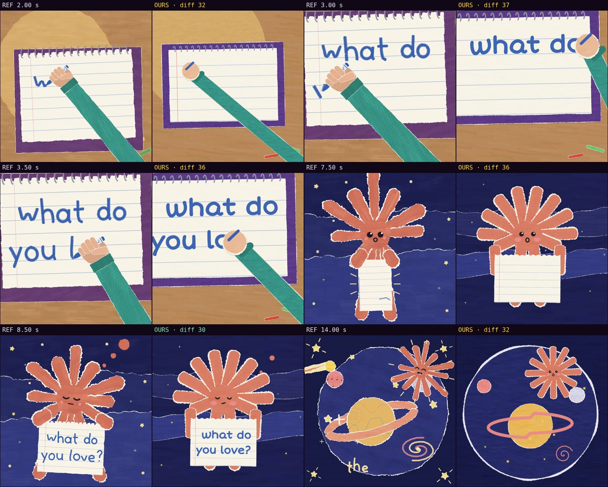

# Comparison with the reference · sandbox/2026-09-24-what-do-you-love/scene.js

Reference: `reference.mp4` · mean difference **33.8** (0 = identical, <30 similar, >60 something else)

| Second | Difference |
|---|---|
| 2.00 | 31.9 |
| 3.00 | 37.2 |
| 3.50 | 35.6 |
| 7.50 | 36.4 |
| 8.50 | 29.6 |
| 14.00 | 32.3 |

