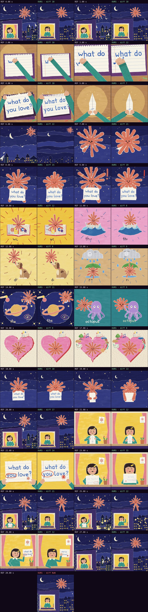

# Comparison with the reference · sandbox/2026-09-24-what-do-you-love/scene.js

Reference: `reference.mp4` · mean difference **14.2** (0 = identical, <30 similar, >60 something else)

| Second | Difference |
|---|---|
| 0.00 | 18.0 |
| 1.00 | 18.1 |
| 2.00 | 10.0 |
| 3.00 | 21.5 |
| 4.00 | 17.5 |
| 5.00 | 7.4 |
| 6.00 | 22.0 |
| 7.00 | 20.8 |
| 8.00 | 15.4 |
| 9.00 | 18.6 |
| 10.00 | 11.8 |
| 11.00 | 8.1 |
| 12.00 | 7.7 |
| 13.00 | 8.8 |
| 14.00 | 10.9 |
| 15.00 | 9.1 |
| 16.00 | 8.7 |
| 17.00 | 9.0 |
| 18.00 | 9.9 |
| 19.00 | 13.0 |
| 20.00 | 17.3 |
| 21.00 | 11.8 |
| 22.00 | 14.1 |
| 23.00 | 15.0 |
| 24.00 | 20.7 |
| 25.00 | 21.8 |
| 26.00 | 11.9 |
| 27.00 | 17.6 |
| 28.00 | NaN |

