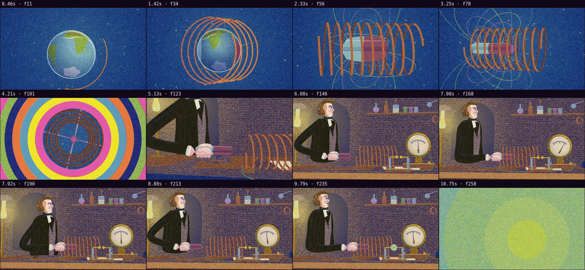

# Automatic review · sandbox/2026-09-25-physics-history/dev/faraday/scene.js

960×540 px · 24 fps · 11.20 s · 269 frames

## Warnings

- None.

## Motion

Energy per second (how much the image changes):

```
▂▄▄▃█▅▃▂▂▃▆▁
0    5    10   
```

No still stretches of 1 s or more.

Large jumps outside cuts (can be normal in dense patterns; check whether they bother): 4.17 s, 4.33 s, 4.50 s, 4.67 s, 10.67 s.

## Speed

Painting: 509 ms/frame cold, 414 ms warm → full render ≈ 111 s at this size.

> Slow: cache static elements with `Motion.sprite` and lower the texture density.

## Contact sheet


