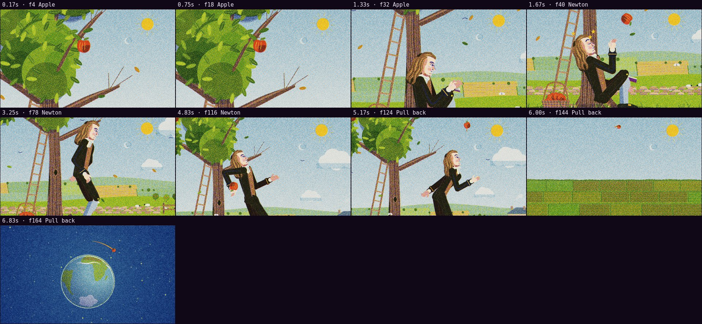

# Automatic review · sandbox/2026-09-25-physics-history/dev/newton-apple/scene.js

960×540 px · 24 fps · 7.00 s · 168 frames · 120 BPM

## Warnings

- None.

## Motion

Energy per second (how much the image changes):

```
▁█▅██▇█
0    5    
```

No still stretches of 1 s or more.

Large jumps outside cuts (can be normal in dense patterns; check whether they bother): 6.33 s.

## Speed

Painting: 440 ms/frame cold, 395 ms warm → full render ≈ 66 s at this size.

## Contact sheet


