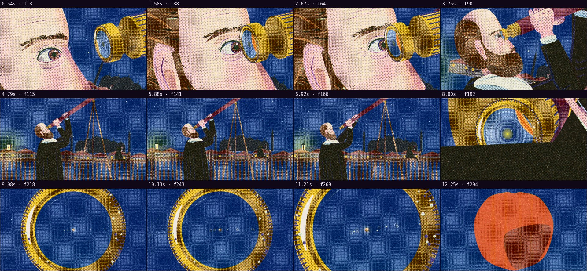

# Automatic review · sandbox/2026-09-25-physics-history/dev/roof/scene.js

960×540 px · 24 fps · 12.80 s · 307 frames

## Warnings

- None.

## Motion

Energy per second (how much the image changes):

```
▃▆▄█▅▂▃█▅▁▃▄▆
0    5    10   
```

No still stretches of 1 s or more.

Large jumps outside cuts (can be normal in dense patterns; check whether they bother): 1.50 s, 3.67 s, 3.83 s, 7.50 s, 7.67 s, 8.17 s.

## Speed

Painting: 413 ms/frame cold, 363 ms warm → full render ≈ 111 s at this size.

## Contact sheet


