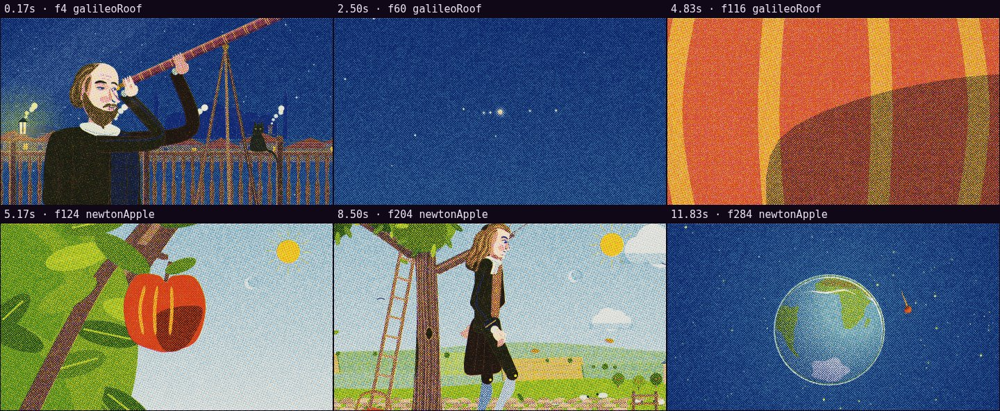

# Automatic review · sandbox/2026-09-25-physics-history/dev/v2/scene.js

960×540 px · 24 fps · 12.00 s · 288 frames · 120 BPM

## Warnings

- None.

## Motion

Energy per second (how much the image changes):

```
▃▅▁▁█▇█▅██▇█
0    5    10   
```

No still stretches of 1 s or more.

Large jumps outside cuts (can be normal in dense patterns; check whether they bother): 6.33 s, 9.33 s, 10.17 s, 11.17 s.

## Speed

Painting: 314 ms/frame cold, 286 ms warm → full render ≈ 82 s at this size.

## Contact sheet


