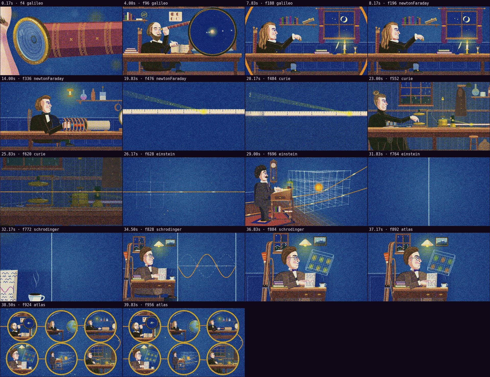

# Automatic review · sandbox/2026-09-25-physics-history/scene.js

960×540 px · 24 fps · 40.00 s · 960 frames · 120 BPM

## Warnings

- None.

## Motion

Energy per second (how much the image changes):

```
▆▇█▃▁▁▃▇▃▄▃▃▂▆▄▂▁▂█▅▇▄▅▄▅▄▆▄▄▅▂▆▅▂▂▅▄▆▃▁
0    5    10   15   20   25   30   35   
```

No still stretches of 1 s or more.

Large jumps outside cuts (can be normal in dense patterns; check whether they bother): 1.67 s, 2.33 s, 2.50 s, 18.50 s, 18.67 s, 19.33 s.

## Speed

Painting: 484 ms/frame cold, 470 ms warm → full render ≈ 452 s at this size.

> Slow: cache static elements with `Motion.sprite` and lower the texture density.

## Contact sheet


