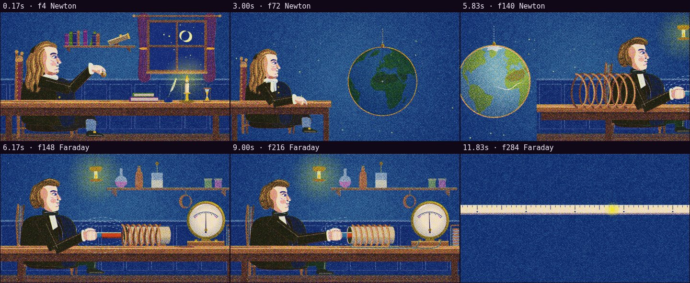

# Automatic review · sandbox/2026-09-25-physics-newton-faraday/scene.js

960×540 px · 24 fps · 12.00 s · 288 frames · 120 BPM

## Warnings

- None.

## Motion

Energy per second (how much the image changes):

```
▃▄▃▃▂▆▄▂▁▃█▆
0    5    10   
```

No still stretches of 1 s or more.

Large jumps outside cuts (can be normal in dense patterns; check whether they bother): 10.50 s, 10.67 s, 11.33 s.

## Speed

Painting: 399 ms/frame cold, 316 ms warm → full render ≈ 91 s at this size.

## Contact sheet


