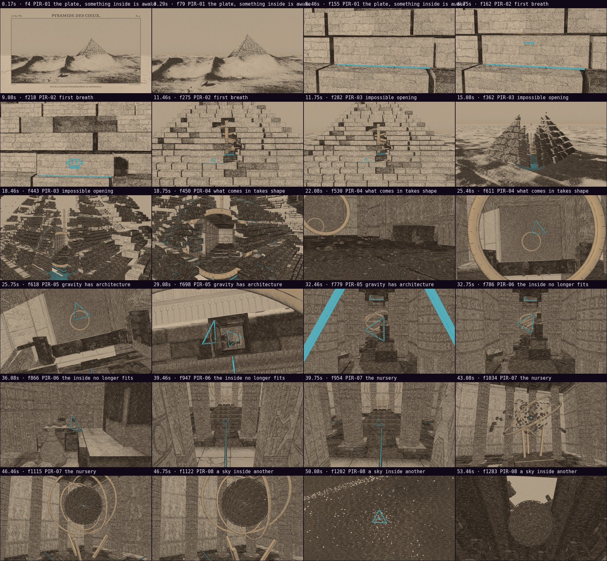
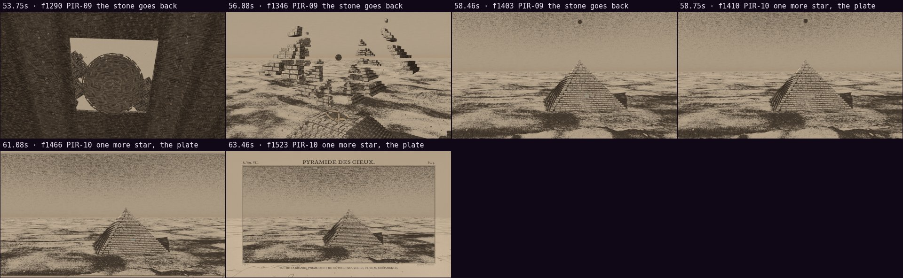

# Automatic review · sandbox/2026-09-26-pyramid-engraving/scene.js

960×540 px · 24 fps · 63.60 s · 1526 frames

## Warnings

- None.

## Motion

Energy per second (how much the image changes):

```
 ▃▄▄▄▇▆▅▇▇▇▇▆▆▅▃▃▆█▆▆▅▅▅▆▇▅▅█▆▆▆▆▅▆▇▆▅▆▆▆▅▅▅▅▅▆▆▄▅▅▅▅▆▆▇▆▅▅▅▃▅  
0    5    10   15   20   25   30   35   40   45   50   55   60   
```

Still stretches of 1 s or more (intended? a visual pause that looks like a glitch is a bug): 0.00 s–1.33 s, 62.00 s–63.50 s.

Large jumps outside cuts (can be normal in dense patterns; check whether they bother): 28.50 s, 28.67 s, 28.83 s.

## Speed

Painting: 216 ms/frame cold, 8 ms warm → full render ≈ 13 s at this size.

## Contact sheet



