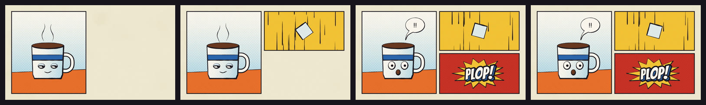

# Comic



A clean-line comic book: brush-ink outlines that swell and taper, flat print colours on newsprint, Ben-Day halftone, panels that pop in on the beat, balloons, sound effects on bursts and speed lines. Motion comic: the drawings change on twos and the camera moves over the page.

**Status:** in testing · **Skill:** [`style-comic`](../../.claude/skills/style-comic/SKILL.md) (the rules and the checklist that keep every video in the style consistent)

## Start a video in this style

```bash
node engine/new.mjs my-test --style comic --duration 4
npm run preview    # http://127.0.0.1:5173
```

`template.js` is the minimal scene `new.mjs` copies.

## Files

| File | What it gives |
|---|---|
| `template.js` | a sleepy mug, a falling sugar cube and a PLOP!, in three panels |
| `comic.js` | `Comic`: brush ink, shapes, Ben-Day dots and graded halftone, newsprint and grain, panels and pop-ins, balloons, sound effects, bursts, speed and motion lines, cartoon hands |

Fonts: [Bangers](../../fonts/OFL-Bangers.txt) and [Comic Neue](../../fonts/OFL-ComicNeue.txt), both SIL OFL 1.1.
