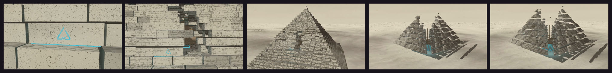

# Engraving



3D scenes printed as a 19th-century copperplate engraving, after the plates of the «Description de l'Égypte»: tone made only of burin lines fixed to the surfaces, cut edges, a ruled sky, laid paper with foxing, and colour only as a second ink (a live blue that prints solid and tints the lines near it, a gold wash under the line work). A WebGL2 rasteriser with instancing, so thousands of stones cost ~2 s a frame without a GPU.

**Status:** in testing · **Skill:** [`style-engraving`](../../.claude/skills/style-engraving/SKILL.md) (the rules and the checklist that keep every video in the style consistent)

## Start a video in this style

```bash
node engine/new.mjs my-test --style engraving --duration 4
npm run preview    # http://127.0.0.1:5173
```

`template.js` is the minimal scene `new.mjs` copies.

## Files

| File | What it gives |
|---|---|
| `template.js` | a few seconds showing the style in miniature |
| `engrave.js` | `Engrave`: meshes (box, pyramid, cylinder, sphere, torus), instancing, a shadow map that follows the subject, burin hatching with constant on-screen spacing, cut edges, pores and chips, ruled sky, desert, paper and second inks |

## Made with it

- [pyramid-engraving](../../sandbox/2026-09-26-pyramid-engraving/) · «The pyramid that makes skies»: the waking joint and the exploded view
