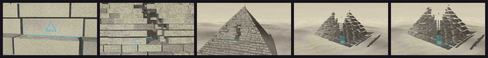

# Engraving



3D scenes drawn as a plate of the «Description de l'Égypte» (1809–1822): charcoal tone on toothed paper, masonry drawn stone by stone, temple walls in low relief after Dendera (registers of offering scenes, invented signs, Hathor capitals, starred ceilings), an aged print whose paper and ink are measured on the original plates, and colour only as a second ink (a live blue, a gold wash). A ruled-burin mode is kept too. A WebGL2 rasteriser with instancing, so thousands of stones cost ~2 s a frame without a GPU.

**Status:** in testing · **Skill:** [`style-engraving`](../../.claude/skills/style-engraving/SKILL.md) (the rules and the checklist that keep every video in the style consistent)

## Start a video in this style

```bash
node engine/new.mjs my-test --style engraving --duration 4
npm run preview    # http://127.0.0.1:5173
```

`template.js` is the minimal scene `new.mjs` copies.

## Files

| File | What it gives |
|---|---|
| `template.js` | a few seconds showing the style in miniature |
| `engrave.js` | `Engrave`: meshes (box, pyramid, cylinder, sphere, torus), instancing, a shadow map that follows the subject, burin hatching with constant on-screen spacing, cut edges, pores and chips, ruled sky, desert, paper and second inks |

## Made with it

- [pyramid-engraving](../../sandbox/2026-09-26-pyramid-engraving/) · «The pyramid that makes skies»: from a printed plate into the pyramid, its machine and a sky inside a seed, and back
