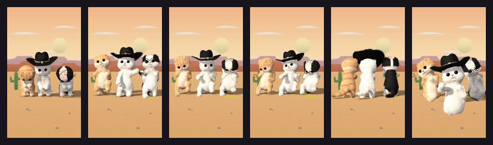

# Felt 3D



Needle-felted wool puppets, raymarched in WebGL2 inside the headless browser: a halo of stray fibres on every silhouette, heathered matte wool, glass bead eyes, stitched mouths and toes. The puppets render over a transparent background with their shadows caught on the floor, so any backdrop can go behind them: a drawn set, a photo, a video.

**Status:** in testing · **Skill:** [`style-felt3d`](../../.claude/skills/style-felt3d/SKILL.md) (the rules and the checklist that keep every video in the style consistent)

## Start a video in this style

```bash
node engine/new.mjs my-test --style felt3d --duration 4
npm run preview    # http://127.0.0.1:5173
```

`template.js` is the minimal scene `new.mjs` copies.

## Files

| File | What it gives |
|---|---|
| `template.js` | a few seconds showing the style in miniature |
| `felt3d.js` | `Felt3D`: the raymarcher (shape prelude, felt shading, stray-fibre halo, caught floor shadow, floor decals, 2D zoom, alpha output, memo per drawing) |

## Made with it

- [felt-cats](../../sandbox/2026-09-25-felt-cats/) · the «dancing cowboy cats» meme in felt, on swappable sets
