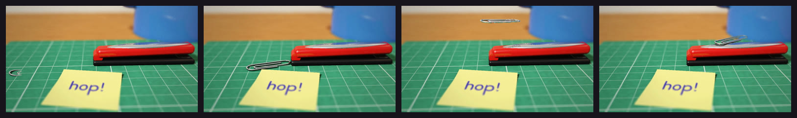

# Tabletop 3D



«An office in miniature»: real desk objects brought to life as stop motion and photographed
like a miniature. Raymarched in WebGL2 with physically-based materials (chrome that reflects
the desk, matte rubber, card with fibres, glossy plastic, printed paper mapped from a canvas),
a softbox and a warm practical, a very shallow depth of field and film grain. Meant to render
on the GPU (`DBC_GPU=1`).

**Status:** in testing · **Skill:** [`style-tabletop3d`](../../.claude/skills/style-tabletop3d/SKILL.md) (the rules and the checklist that keep every video in the style consistent)

## Start a video in this style

```bash
node engine/new.mjs my-test --style tabletop3d --duration 4
npm run preview    # http://127.0.0.1:5173
DBC_GPU=1 node engine/render.mjs sandbox/<exp>/scene.js --size 1920
```

`template.js` is the minimal scene `new.mjs` copies.

## Files

| File | What it gives |
|---|---|
| `template.js` | a paper clip hops across a cutting mat onto a stapler, a sticky note says so |
| `tabletop3d.js` | `Tabletop3D`: the raymarcher (shape prelude, PBR-lite shading, one traced reflection, soft shadows and contact occlusion, canvas textures, depth of field, banded GPU passes, grain and vignette, stop-motion flicker and nudges, a two-bone IK) |
